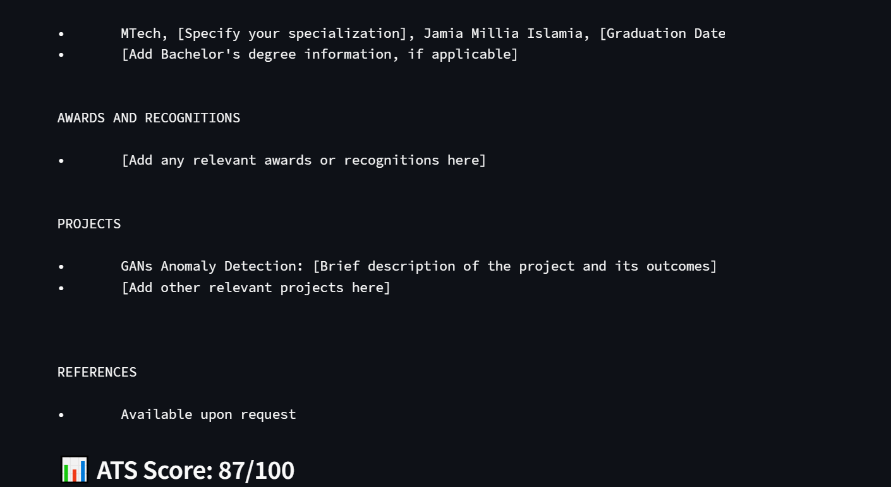

# 📝 Gemini Resume Builder with ATS Scoring

An AI-powered resume builder that uses **Google Gemini** to generate a complete, well-formatted, and ATS-optimized resume from a simple professional summary. Built using **Streamlit**, this tool lets you view, download, and evaluate your resume with a simple ATS scoring system.

---

## 🚀 Features

- 🔥 Generates complete professional resumes from your input summary
- 🤖 Uses Gemini 1.5 Flash for accurate and relevant resume content
- 📊 Calculates a basic ATS (Applicant Tracking System) score
- 🧾 Allows PDF download of the generated resume
- ⚡ Clean, simple, and user-friendly Streamlit interface

---

## 🖼 Demo Screenshot


## Output





## 🛠 Tech Stack

- [Streamlit](https://streamlit.io/)
- [Google Gemini API](https://ai.google.dev/)
- [ReportLab](https://www.reportlab.com/) (for PDF generation)
- [Python-dotenv](https://pypi.org/project/python-dotenv/) (for managing API keys)

---

## 📦 Installation

### 1. Clone the repository

```bash
git clone https://github.com/your-username/gemini-resume-builder.git
cd gemini-resume-builder
